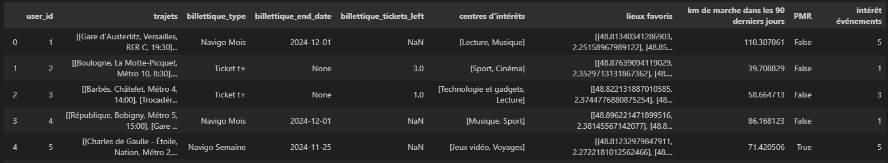
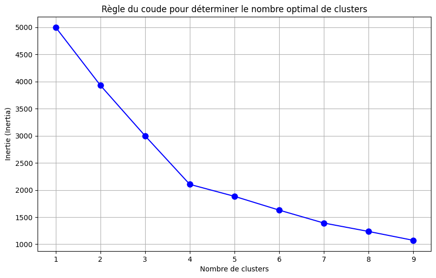

# ReadMe - Personnalisation des Services de Mobilité

Ce projet a été développé dans le cadre du [Hackathon IA et Mobilités](https://www.iledefrance-mobilites.fr/actualites/hackathon-2024-ia-et-mobilites), organisé par Île-de-France Mobilités les 21 et 22 novembre 2024. 

## Présentation du projet

L'objectif de ce projet est de proposer une solution de personnalisation des services de mobilité, en utilisant des techniques d'intelligence artificielle afin d'améliorer l'expérience utilisateur des voyageurs en Île-de-France. Nous avons exploré les moyens d'utiliser les données de mobilité et les modèles d'IA pour offrir des recommandations pertinentes et personnalisées aux usagers.

### Le problème et la proposition de valeur

- **Problème à résoudre** : Comment personnaliser l'expérience utilisateur des services numériques liés aux transports en commun pour améliorer la satisfaction et l'engagement des voyageurs ? Les usagers ont des besoins variés en fonction de leur situation (ex : abonnement expirant, manque de tickets, difficultés de mobilité).
- **Usagers cibles** : Les voyageurs réguliers, les touristes et les personnes à mobilité réduite (PMR) utilisant les services de transport en commun en Île-de-France.

### La solution

- **Solution proposée** : Nous avons développé une solution qui génère des messages personnalisés pour les usagers en fonction de leur type d'abonnement et de leurs habitudes de déplacement. Cette personnalisation est basée sur des données telles que le type de billettique (Navigo Mois, Navigo Semaine, Ticket t+), la validité de l'abonnement, et le nombre de tickets restants.
- **Fonctionnement général** : Les données utilisateurs sont collectées et un modèle d'IA est utilisé pour générer des messages qui alertent les usagers de manière proactive. Par exemple, un utilisateur dont l'abonnement expire bientôt ou qui a un nombre limité de tickets restants recevra une notification personnalisée. Le système est conçu pour éviter d'envoyer des messages inutiles aux utilisateurs qui n'ont pas de besoin immédiat.
- **Données mobilisées** : Nous avons utilisé des données fictives de déplacement et d'abonnement, générées spécifiquement pour ce hackathon, afin de simuler les différents profils d'usagers.

### Méthodologie



- **Clustering des utilisateurs** : Pour mieux comprendre les besoins des usagers, nous avons appliqué des techniques de clustering sur les données afin de dégager des profils types. Ces profils incluent des catégories telles que les "voyageurs réguliers", les "touristes" et les "personnes à mobilité réduite (PMR)". Ce regroupement a permis de personnaliser plus efficacement les messages envoyés.

- **Génération de messages personnalisés** : Nous avons utilisé la configuration LLM (Large Language Model) disponible dans l'environnement du hackathon pour générer des messages personnalisés en fonction des caractéristiques spécifiques de chaque utilisateur. Les messages sont générés uniquement lorsque cela est pertinent (par exemple, lorsque l'abonnement est sur le point d'expirer ou que le nombre de tickets est bas).
- **Sélection aléatoire d'utilisateurs** : Pour tester notre approche, nous avons sélectionné aléatoirement cinq utilisateurs parmi l'ensemble des données et avons généré des messages personnalisés pour eux.

### Les problèmes surmontés

- **Authentification avec les services Azure** : Au début, des difficultés ont été rencontrées lors de l'utilisation des API Azure OpenAI. Ces problèmes ont été surmontés en utilisant une configuration personnalisée d'un LLM (Large Language Model) déjà accessible via notre environnement.
- **Complexité des données utilisateur** : Les données utilisateurs comportaient des informations complexes, notamment des listes de trajets et des centres d'intérêts variés. Nous avons dû adapter notre modèle de clustering pour dégager des profils types afin de rendre les recommandations pertinentes.

### Et la suite ?

- **Déploiement en production** : Si nous avions plus de temps, nous aimerions intégrer cette solution dans une application mobile existante, comme celle d'Île-de-France Mobilités, afin de tester son impact sur les usagers réels.
- **Améliorations des recommandations** : Intégrer des données en temps réel (comme des perturbations de trafic) et proposer des alternatives en fonction du contexte.
- **Personnalisation plus fine** : Utiliser davantage de variables pour affiner les recommandations, comme les préférences déclarées par l'utilisateur ou des analyses de comportement en temps réel.

## Installation et utilisation

Pour installer et utiliser ce projet, vous aurez besoin de Python 3 et des librairies suivantes :
- pandas
- langchain
- llm_management (fournie pendant le hackathon)
- dotenv (pour charger les variables d'environnement)

### Étapes d'installation
1. Cloner le répertoire du projet.
2. Installer les dépendances via pip :
   ```bash
   pip install -r requirements.txt
   ```
3. Créer un fichier `.env` avec vos clés API et configurations nécessaires.
4. Lancer le script principal pour générer des messages personnalisés.

## Licence

Le code et la documentation de ce projet sont sous licence [MIT](LICENSE).

